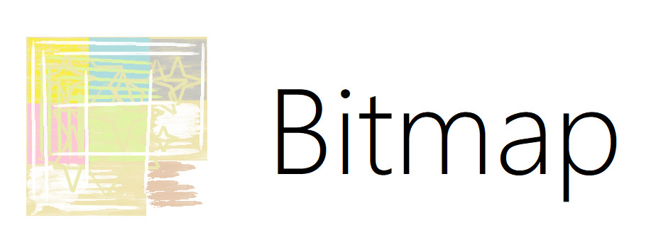

Build complex bitmaps in your mobile phone.

* Bitmap = pixel grid
* Bitmap channels = red, green, blue, alpha
* Sketch shapes and rasterize them as you wish.

## Examples

## Shapes

Any shape form is possible; whether it has open contours or not. You start a shape by touching there and there, and you may use curve control points around the points you touched.

Once a shape is good enough, you may rasterize it into a bitmap and perform complex graphics.

## Alignment

For the selected point in a shape, you may see its $(x, y)$ position in pixels and assign a new position for each coordinate as necessary.

### Snapping

If you are pretending to build perfect shapes (that is, from triangle to square to pentagon), enable Snapping and the next point you add will conform to the previous point.

