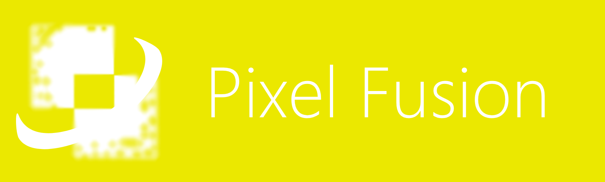

  

(Abstract)

Build complex bitmaps and shapes.

* Bitmap = pixel grid
* Bitmap channels = red, green, blue, alpha
* Sketch shapes and rasterize them as you wish.
* Save the project as a PSD file, a PNG file, or a SVG file.

## Examples

An oval consists of 4 curved segments.

## Shape tool

Any shape form is possible; whether it has open contours or not. You start a shape by touching there and there, and you may use curve control points around the points you touched.

Once a shape is good enough, you may rasterize it into a bitmap and perform complex graphics.

## Alignment

For the selected point in a shape, you may see its $(x, y)$ position in pixels and assign a new position for each coordinate as necessary.

### Snapping

If you are pretending to build perfect shapes (that is, from triangle to square to pentagon), enable Snapping and the next point you add will conform to the previous point.

## Effects

Effects may be applied to a layer, altering its pixels, whether in color, position, distortion, or delocation.

* Blur
* Shadow drop
* Color multiplier, subtraction, and more
* Lots more

## Selection tool

The selection tool selects only bitmaps in a layer, and not shapes, in which case the shape tool is used.

* Rectangular
* Ellipse
* Free-form (drag-draw-drop)
* By color-range (like near RGB = `#00FF00`)

## Zoom

Zoom is usually done by pinching into the screen through two fingers.

## Project Format

The application includes its own project file format because it is not just bitmap-oriented, but also includes shapes, layers, masks, effects, groups, and more.

The project format may always be saved as a common PNG file.
