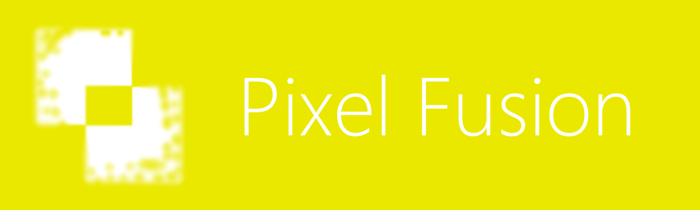

  

(Abstract)

Build complex bitmaps and shapes.

* Bitmap = pixel grid
* Bitmap channels = red, green, blue, alpha
* Sketch shapes and rasterize them as you wish.
* Save the project as a PSD file, a PNG file, a JPEG file, a BMP file, a GIF file, or a SVG file.
* Save the timeline as an image sequence.

## Path tool

### Alignment

For the selected point in a path, you may see its $(x, y)$ position in pixels and assign a new position for each coordinate as necessary.

### Snapping

If you are pretending to build perfect shapes (that is, from triangle to square to pentagon), enable Snapping and the next point you add will conform to the previous point.

## Effects

Effects may be applied to a layer, altering its pixels, whether in color, position, distortion, or delocation.

* Blur
* Shadow drop
* Color multiplier, subtraction, and more
* Lots more

## Selection tool

The selection tool selects only bitmaps in a layer, and not shapes, paths or texts.

* Rectangular
* Ellipse
* Free-form (drag-draw-drop)
* By color-range (like near RGB = `#00FF00`)

## Sprite sheet

The sprite sheet mode allows configuring a sprite sheet file that may consist of a few specific frame layouts and editing it efficiently through the timeline.

## Several

* Zoom
